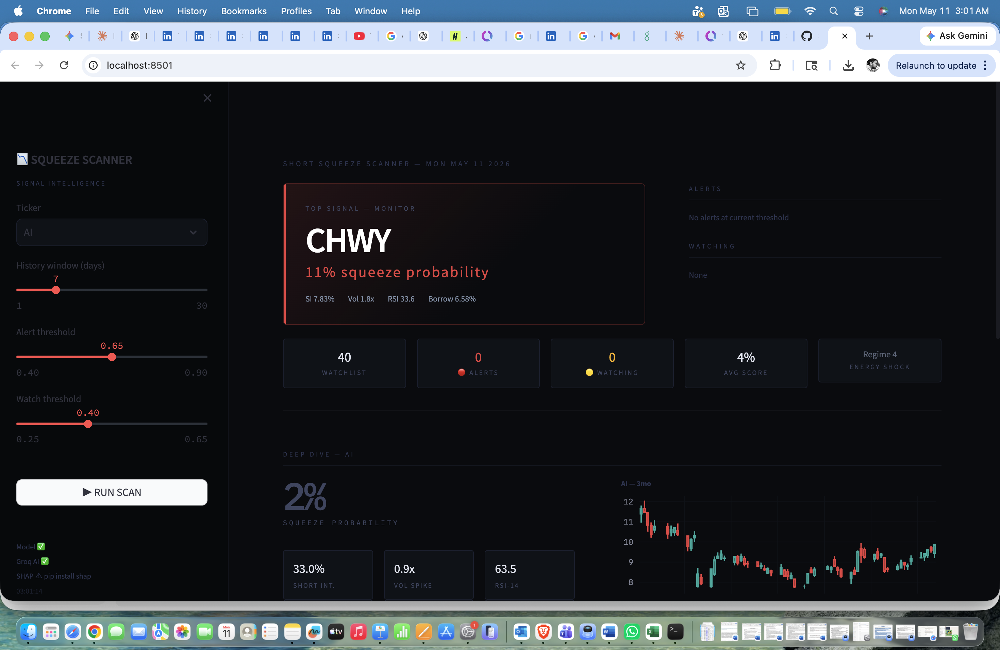
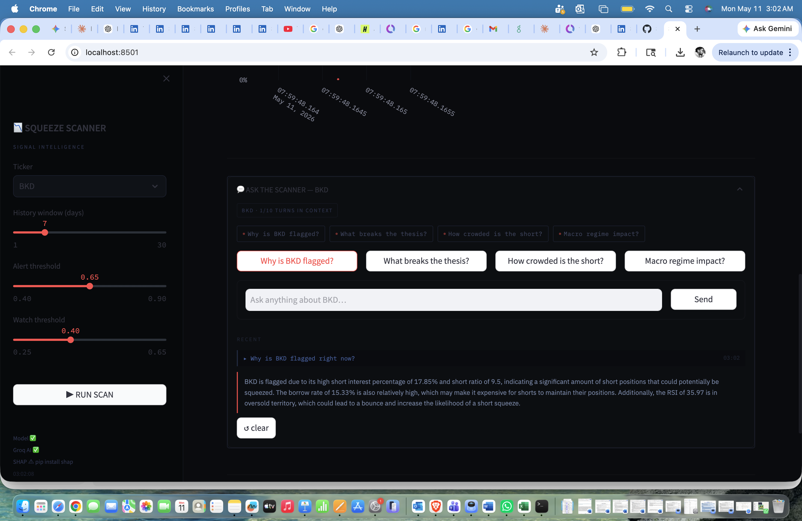

## 📊 Live Dashboard Output

The dashboard aggregates market, sentiment, and short interest signals into a single ranked view.

### Interpretation
- GME → High squeeze risk due to borrow rate + sentiment spike
- AMC → Medium risk, mixed signals
- AAPL → No squeeze conditions detected
